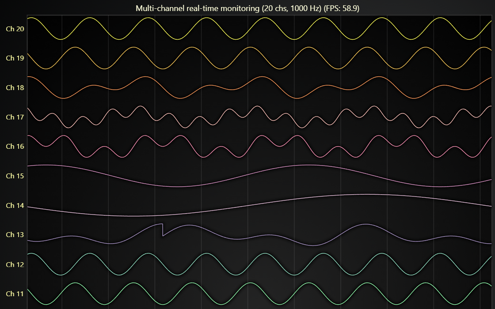

# JavaScript HTML Scroll Bars Dashboard

This demo application belongs to the set of examples for LightningChart JS, data visualization library for JavaScript.

LightningChart JS is entirely GPU accelerated and performance optimized charting library for presenting massive amounts of data. It offers an easy way of creating sophisticated and interactive charts and adding them to your website or web application.

The demo can be used as an example or a seed project. Local execution requires the following steps:

-   Make sure that relevant version of [Node.js](https://nodejs.org/en/download/) is installed
-   Open the project folder in a terminal:

          npm install              # fetches dependencies
          npm start                # builds an application and starts the development server

-   The application is available at _http://localhost:8080_ in your browser, webpack-dev-server provides hot reload functionality.

## Description

Showcases how to fit a large number of charts into 1 view and fallback to HTML scroll bars when all of the content does not fit to view.

This approach allows fitting incredible amounts of data visualization into a single view. Note that with massive 10000+ high or wide charts to you may run into some precision issues and the charts might not look proper. This is due to WebGL limitations.

This line chart uses thin line rendering for the best performance, especially visible on devices with weak GPUs such as mobile devices and laptops.
For a thicker alternative you can check out [a similar line chart with best-looking line graphics](https://www.lightningchart.com/lightningchart-js-interactive-examples/examples/0028-multiChannelLineProgressiveOwnAxes.html)

## API Links

* [XY cartesian chart]
* [Line series]
* [Data patterns]
* [Axis]

## Support

If you notice an error in the example code, please open an issue on [GitHub][0] repository of the entire example.

Official [API documentation][1] can be found on [LightningChart][2] website.

If the docs and other materials do not solve your problem as well as implementation help is needed, ask on [StackOverflow][3] (tagged lightningchart).

If you think you found a bug in the LightningChart JavaScript library, please contact support@lightningchart.com.

Direct developer email support can be purchased through a [Support Plan][4] or by contacting sales@lightningchart.com.

[0]: https://github.com/Arction/
[1]: https://lightningchart.com/lightningchart-js-api-documentation/
[2]: https://lightningchart.com
[3]: https://stackoverflow.com/questions/tagged/lightningchart
[4]: https://lightningchart.com/support-services/

© LightningChart Ltd 2009-2022. All rights reserved.

[XY cartesian chart]: https://lightningchart.com/lightningchart-js-api-documentation/v4.1.0/classes/ChartXY.html
[Line series]: https://lightningchart.com/lightningchart-js-api-documentation/v4.1.0/classes/LineSeries.html
[Data patterns]: https://lightningchart.com/lightningchart-js-api-documentation/v4.1.0/interfaces/DataPattern.html
[Axis]: https://lightningchart.com/lightningchart-js-api-documentation/v4.1.0/classes/Axis.html

